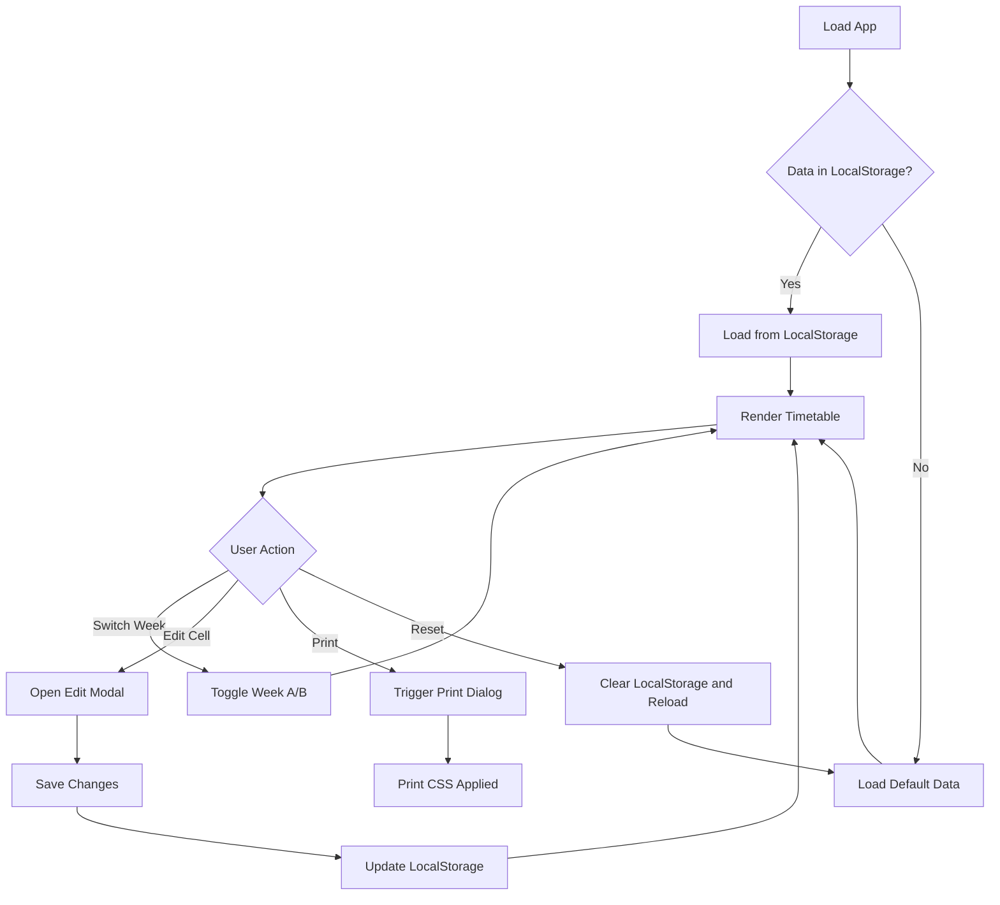

# School Timetable Web App - Architecture Plan

## Overview
A simple, responsive web application for viewing and editing a two-week school timetable (Week A and Week B). The app should work on mobile and desktop, with print functionality optimized for iPhone-size hardcopies.

## Requirements Summary

| Requirement | Description |
|-------------|-------------|
| Editable | Users can modify class, teacher, and room for each cell |
| Row Headers | Periods: AAM, AM, RC, 1, 2, R, 3, 4, L, 5, PM |
| Column Headers | Days: Monday, Tuesday, Wednesday, Thursday, Friday |
| Two Weeks | Week A and Week B displayed separately |
| Responsive | Works on mobile and desktop |
| Printable | Optimized for iPhone-size printout |

## Timetable Structure

### Row Headers (Periods)
Based on the image, the periods are:
1. **AAM** - Assembly Morning
2. **AM** - Morning
3. **RC** - Roll Call
4. **1** - Period 1
5. **2** - Period 2
6. **R** - Recess
7. **3** - Period 3
8. **4** - Period 4
9. **L** - Lunch
10. **5** - Period 5
11. **PM** - Afternoon

### Cell Structure
Each timetable cell contains three components:
- **Class Name** (e.g., 7SP4, 7WELD)
- **Teacher** (e.g., PERJ, GARS)
- **Room** (e.g., G54, E37)

## Data Model

```json
{
  "weekA": {
    "monday": [
      { "period": "AAM", "class": "", "teacher": "", "room": "" },
      { "period": "AM", "class": "", "teacher": "", "room": "" },
      { "period": "RC", "class": "", "teacher": "", "room": "" },
      { "period": "1", "class": "7ENG", "teacher": "SMIJ", "room": "G23" },
      { "period": "2", "class": "7MAT", "teacher": "JONB", "room": "E15" },
      { "period": "R", "class": "", "teacher": "", "room": "" },
      { "period": "3", "class": "7SCI", "teacher": "PERJ", "room": "G54" },
      { "period": "4", "class": "7HIS", "teacher": "GARS", "room": "E37" },
      { "period": "L", "class": "", "teacher": "", "room": "" },
      { "period": "5", "class": "7PE", "teacher": "WILS", "room": "GYM" },
      { "period": "PM", "class": "", "teacher": "", "room": "" }
    ],
    "tuesday": [...],
    "wednesday": [...],
    "thursday": [...],
    "friday": [...]
  },
  "weekB": {
    "monday": [...],
    ...
  }
}
```

## Architecture

### Technology Stack
- **HTML5** - Structure
- **CSS3** - Styling with CSS Grid/Flexbox for responsive layout
- **Vanilla JavaScript** - No frameworks needed for this simple app
- **LocalStorage** - Data persistence

### File Structure
```
timetable_app/
├── index.html          # Main HTML file
├── css/
│   └── styles.css      # All styles including print
├── js/
│   ├── app.js          # Main application logic
│   ├── storage.js      # LocalStorage handling
│   └── data.js         # Default/sample data
├── media/
│   └── IMG_3055.jpeg   # Original timetable image
└── plans/
    └── timetable-app-plan.md
```

## UI/UX Design

### Layout - Desktop
```
┌─────────────────────────────────────────────────────────────┐
│  📚 School Timetable           [Week A] [Week B]    [Edit]  │
├─────────────────────────────────────────────────────────────┤
│        │  Mon   │  Tue   │  Wed   │  Thu   │  Fri   │       │
├────────┼────────┼────────┼────────┼────────┼────────┤       │
│  AAM   │        │        │        │        │        │       │
│  AM    │        │        │        │        │        │       │
│  RC    │        │        │        │        │        │       │
│  1     │ 7ENG   │ 7MAT   │ 7SCI   │ ...    │ ...    │       │
│  2     │ 7MAT   │ 7ENG   │ 7HIS   │ ...    │ ...    │       │
│  R     │ RECESS │ RECESS │ RECESS │ RECESS │ RECESS │       │
│  3     │ ...    │ ...    │ ...    │ ...    │ ...    │       │
│  4     │ ...    │ ...    │ ...    │ ...    │ ...    │       │
│  L     │ LUNCH  │ LUNCH  │ LUNCH  │ LUNCH  │ LUNCH  │       │
│  5     │ ...    │ ...    │ ...    │ ...    │ ...    │       │
│  PM    │        │        │        │        │        │       │
└────────┴────────┴────────┴────────┴────────┴────────┘       │
│                                          [Print] [Reset]    │
└─────────────────────────────────────────────────────────────┘
```

### Layout - Mobile
```
┌─────────────────────┐
│ 📚 Timetable        │
│ [Week A] [Week B]   │
│ [Edit Mode]         │
├─────────────────────┤
│        │ Mon │ Tue  │
├────────┼─────┼──────┤
│  AAM   │     │      │
│  AM    │     │      │
│  RC    │     │      │
│  1     │7ENG │7MAT  │
│  2     │7MAT │7ENG  │
│  R     │RECESS      │
│  3     │ ... │ ...  │
│  4     │ ... │ ...  │
│  L     │LUNCH       │
│  5     │ ... │ ...  │
│  PM    │     │      │
└────────┴─────┴──────┘
│ [Print] [Reset]     │
└─────────────────────┘
```

### Week Selection
- Tab-based toggle between Week A and Week B
- Clear visual indicator of current week

### Edit Mode
- Click on a cell to edit
- Modal popup or inline editing with three fields:
  - Class name
  - Teacher
  - Room
- Save/Cancel buttons
- Auto-save to LocalStorage on change

## Responsive Design Strategy

### Breakpoints
- **Mobile**: < 600px - Scrollable table with sticky headers
- **Tablet**: 600px - 900px - Condensed layout
- **Desktop**: > 900px - Full layout with all features

### CSS Techniques
- CSS Grid for timetable layout
- Flexbox for header and controls
- `position: sticky` for row/column headers
- Media queries for responsive breakpoints
- `@media print` for print styles

## Print Design

### iPhone-Size Printout
- Target size: ~3.5 x 6 inches (iPhone screen dimensions)
- Landscape orientation for better fit
- Reduced font sizes
- Remove navigation/edit controls
- High contrast for readability
- Page break handling

### Print CSS Approach
```css
@media print {
  /* Hide non-essential elements */
  .no-print { display: none; }
  
  /* Optimize for small paper size */
  @page {
    size: landscape;
    margin: 5mm;
  }
  
  /* Compact timetable */
  .timetable {
    font-size: 8pt;
  }
}
```

## Features

### Core Features
1. **View Timetable** - Display Week A or Week B
2. **Edit Cells** - Click to edit class, teacher, room
3. **Save Data** - Auto-save to LocalStorage
4. **Print** - Print-friendly output
5. **Reset** - Restore to default/sample data

### Future Enhancements (Optional)
- Export/Import JSON data
- Color coding by subject
- Current day/period highlighting
- Dark mode

## Implementation Flow Diagram



## Technical Considerations

### Accessibility
- Semantic HTML table structure
- ARIA labels for screen readers
- Keyboard navigation support
- High contrast colors

### Performance
- Minimal JavaScript
- CSS-first animations
- No external dependencies
- Fast LocalStorage reads/writes

### Browser Support
- Modern browsers (Chrome, Firefox, Safari, Edge)
- Mobile Safari and Chrome

## Next Steps

1. **Code Mode**: Implement the HTML structure
2. **Code Mode**: Create CSS styles (responsive + print)
3. **Code Mode**: Build JavaScript functionality
4. **Test**: Verify on mobile and desktop
5. **Test**: Verify print output

---

## Questions for User

Before proceeding to implementation, please confirm:

1. **Period names** - Are AAM, AM, RC, PM break times that should be styled differently or left blank?
2. **Color scheme** - Any preference for colors? (School colors?)
3. **Default data** - Should I use generic sample data or would you like to provide the actual timetable?
4. **Edit mode preference** - Inline editing (click cell to edit directly) or modal popup (separate dialog)?
